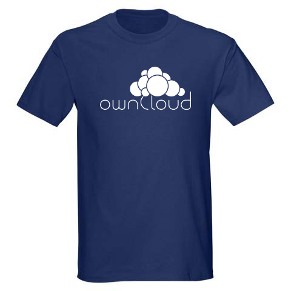

# Promo

ownCloud promotion material like logos, sticker templates, flyers and talk decks. Everyone is welcome to print material and present ownCloud at events – permission is not needed, everyone can help in the community!


## Logo


The logo is white on dark blue (#1d2d42). It should not be used differently, especially not inversed. The text can be optionally left out though. The typeface of the logo (or similar ones) should not be used anywhere else. Better use [FreeSans](http://www.gnu.org/software/freefont/), which is an open remake of Helvetica.


## Sticker


Stickers are outdoor foil, DIN A8 (52x74 mm). We always order through [Flyeralarm (German)](http://www.flyeralarm.com/de/shop/configurator/index/id/34/aufkleber-outdoor.html#159=582&160=583&161=615&162=585) and usually get a batch of 2500 for around 35 €.
These stickers seem to get damaged over time though, so if you know a better printer please let us know.


## Shirt



Shirts are navy blue with simple white logo print centered on the chest. The model is EarthPositive EP03 slim-fit, we ordered through [Black Star Cotton (German)](http://www.cotton.de/hersteller/earthpositive/ep03-mens-slim-fit-shirt/) and the shirts are really good. Regarding size distribution, we ordered 50 consisting of: 6 S, 16 M, 17 L, 8 XL, 3 XXL – which turned out well. Shirts and print combined cost about 7 € per shirt. Just make sure to use the high-resolution ```ownCloud shirt logo.png```.


## Presentation

This presentation is a good start, with simple dark blue background and white [FreeSans](http://www.gnu.org/software/freefont/) for text. But it’s a bit old: It was done in 2011 and first held at [RMLL Strasbourg](http://2011.rmll.info/Presenting-ownCloud), and again at [PHP Usergroup Stuttgart (German)](http://www.phpugs.de/archives/161-Treffen-04.2012,-Vortrag-Vorstellung-des-Projektes-ownCloud.html). It would need to be updated, especially the screenshots.
