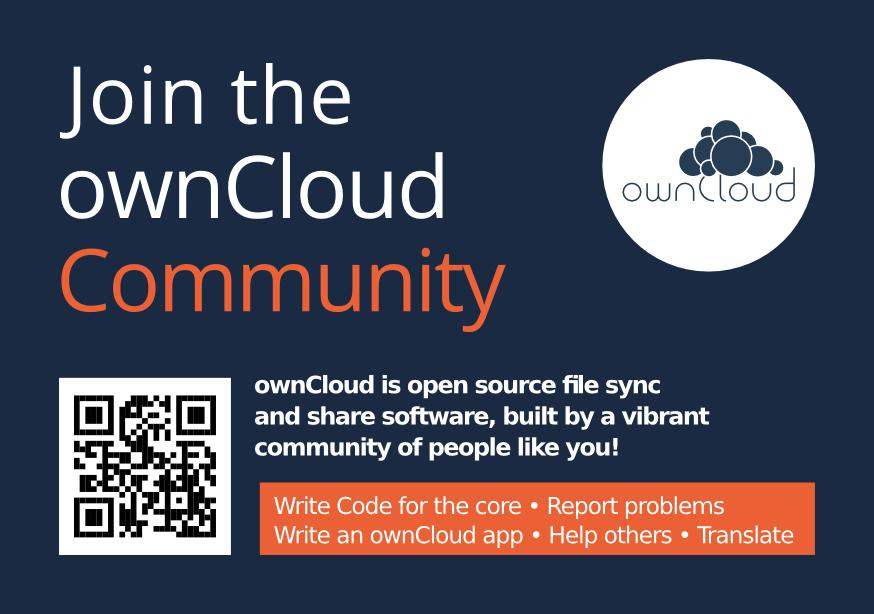

# DEPRECATED

:exclamation::exclamation::exclamation: 
__This repository is not longer maintained. Please see [owncloud.com/trademark](https://owncloud.org/trademark) for latest logos and promo material. If you miss anything write us a quick message to community@owncloud.com.__


# Promo

ownCloud promotion material like logos, sticker templates, flyers and talk decks. Everyone is welcome to print material and present ownCloud at events – permission is not needed, everyone can help in the community! See [owncloud.org/events](http://owncloud.org/events) for information and events.


## Logo


The logo is white on dark blue (#1d2d44). It should not be used differently, especially not inversed. The name »ownCloud« can be optionally left out though.

The typeface of the logo (or similar ones) should not be used anywhere else. Instead use [Open Sans](https://en.wikipedia.org/wiki/Open_Sans), in light weight (not regular!). Use semibold (not bold!) sparingly and only for selected emphasis.


## Sticker


Stickers are outdoor foil, DIN A8 (52x74 mm). We always order through [Flyeralarm (German)](http://www.flyeralarm.com/de/shop/configurator/index/id/34/aufkleber-outdoor.html#159=582&160=583&161=615&162=585) and usually get a batch of 2500 for around 35 €.
These stickers seem to get damaged over time though, so if you know a better printer please let us know.

## Postcard



The postcard is A6 size. The PDF file uses the company logo, the svg and jpg's don't. There's a German version, too. Tip: print the English version on one side, localized version on the other.


## Flyers
We have two flyers at the moment, one targeting users and one for potential contributors or app developers.


## Posters

We have a variety of posters you can use to call out to people to join the hacking fun or use ownCloud. Feedback welcome!


## Shirt


Shirts are navy blue with simple white logo print centered on the chest. The model is EarthPositive EP03 slim-fit, we ordered through [Black Star Cotton (German)](http://www.cotton.de/hersteller/earthpositive/ep03-mens-slim-fit-shirt/) and the shirts are really good. Regarding size distribution, we ordered 50 consisting of: 6 S, 16 M, 17 L, 8 XL, 3 XXL – which turned out well. Shirts and print combined cost about 7 € per shirt. Just make sure to use the high-resolution ```ownCloud shirt logo.png```.


## Presentations

You can find presentation slides and templates in the Presentation materials sub folder. We're working on more ready-to-use slides there, for now it contains a presentation of ownCloud 7 and templates for LibreOffice and Microsoft Office as well as icons you can use.

Find presentation tips and information on [this page](https://owncloud.org/events/conference-program/speaking/) on owncloud.org.
